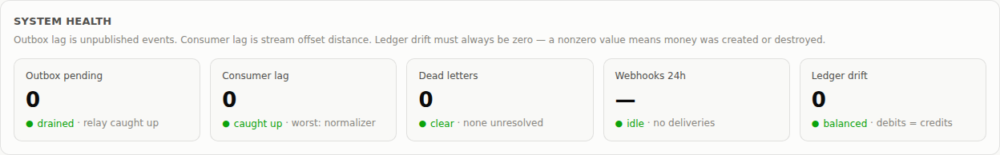
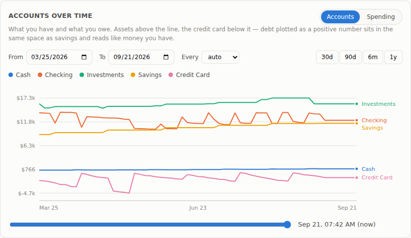
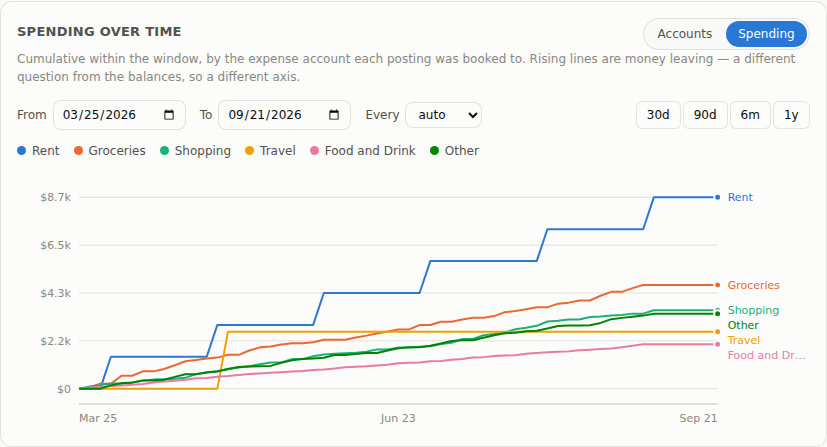
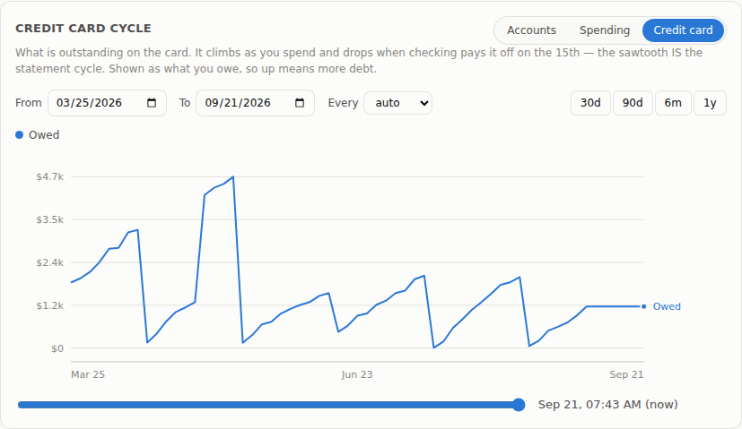
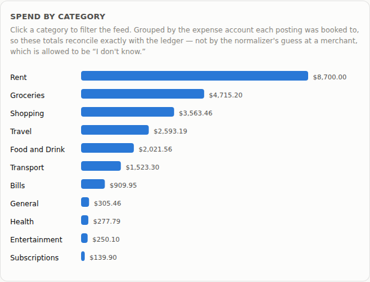
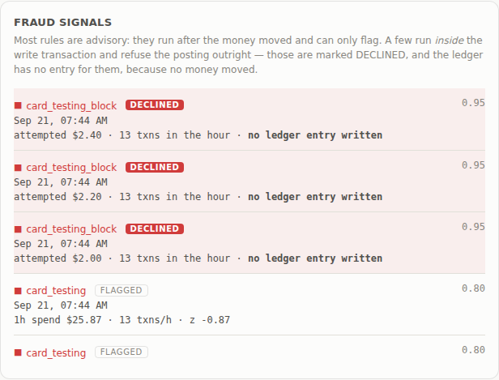
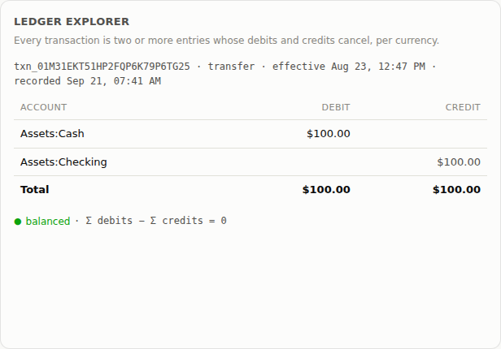
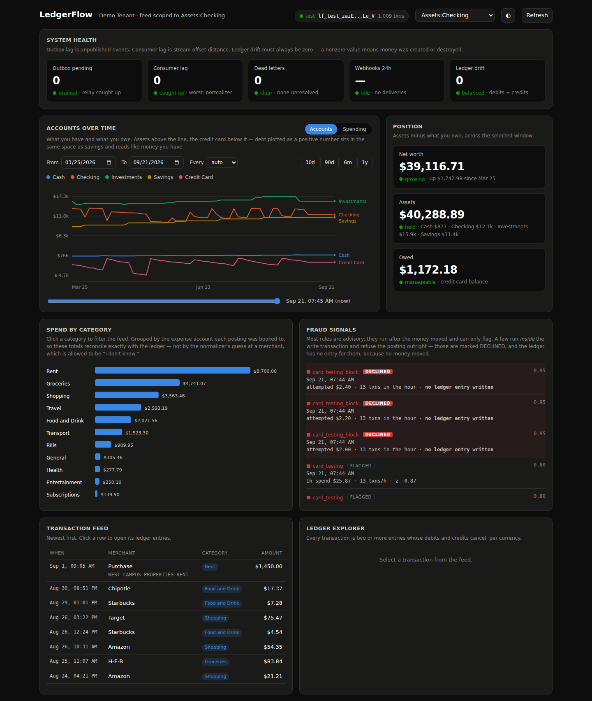

# LedgerFlow

[](https://github.com/ygnewyork/ledgerflow/actions/workflows/tests.yml)

A real-time financial event platform, where an HTTP API ingests transaction
events, posts them to an immutable double-entry ledger, fans them out through a
durable event stream, and exposes balances, analytics, and webhooks to
developers.

---

> Money movement is recorded exactly once, never silently lost or
> double-counted, and every derived number (balance, aggregate, fraud signal)
> can be recomputed from the log.

---


---

## How it works

Every transaction is written twice: once for where the money left, once for
where it landed. The sum of these events is zero, which is
what makes the books checkable. You never need to know what a balance should
be, only that the total is still zero.

That rule is not enforced in application code. It is a Postgres constraint
trigger that fires at `COMMIT`, once all the entries of a transaction exist. A
bug in the API cannot write an unbalanced transaction, and neither can a
hand-written SQL statement.

Writes are idempotent. Every request carries an `Idempotency-Key`, and the
record of that key commits **in the same transaction** as the ledger entries it
describes. That placement is important: write the key first and a crash
can leave it claimed for work that never happened, write it after and money can
move with no record of the request that moved it.

Telling the rest of the system is the same problem again. You cannot commit to
a database and publish to a broker atomically, so the event is written as a row
in that same transaction and a relay publishes it afterwards. Delivery is
at-least-once and every consumer dedupes on `event_id`. Nothing here claims
exactly-once, because nothing can.

The consumers handle the rest. One resolves raw card descriptors like
`SQ *BLUE BOTTLE SF` into canonical merchants, one scores transactions for
fraud, one delivers webhooks with retries and a dead-letter queue. Most fraud
rules are advisory: they run after the money moved and can only flag. One runs
inside the write transaction and refuses the posting, which is why some signals
in the dashboard read **DECLINED** and have no ledger entry behind them.

The same window definitions feed the online and offline paths. Spark recomputes
the features in batch so a model can train on history, and
`python -m ledgerflow.spark.parity` checks that the two sides actually agree.

---

## Architecture

```
  ┌──────────┐   Idempotency-Key      ┌───────────────────────────────┐
  │ SDK /    │ ─────────────────────► │  API  (FastAPI)               │
  │ curl     │ ◄───────────────────── │  auth · validate · rate-limit │
  └──────────┘   replayed response    └───────────────┬───────────────┘
                                                      │
                          ┌───────────────────────────┴──────────────────┐
                          │  ONE Postgres transaction                    │
                          │   1. idempotency_keys row  (owns the request)│
                          │   2. transactions + entries (the ledger)     │
                          │   3. outbox row            (the event)       │
                          │   COMMIT  ← the only durability boundary     │
                          └───────────────────────────┬──────────────────┘
                                                      │
                                          ┌───────────▼───────────┐
                                          │  outbox relay          │
                                          │  (poll or Debezium CDC)│
                                          └───────────┬───────────┘
                                                      │ at-least-once
                                          ┌───────────▼───────────┐
                                          │  Redpanda / Kafka      │
                                          │  key = account_id      │
                                          └───┬────────┬───────┬───┘
                                              │        │       │
                   ┌──────────────────────────┘        │       └────────────────┐
                   ▼                                   ▼                        ▼
         ┌──────────────────┐              ┌────────────────────┐   ┌────────────────────┐
         │ normalizer       │              │ risk / features    │   │ webhook dispatcher │
         │ raw → canonical  │              │ Redis windows      │   │ HMAC · backoff·DLQ │
         │ merchant + cat   │              │ rules → signals    │   └────────────────────┘
         └────────┬─────────┘              └─────────┬──────────┘
                  │                                  │
                  ▼                                  ▼
         normalized_transactions             fraud_signals
                  │
                  └──────────► Delta Lake / Spark ──► features + backfills
```

The consumers are all derived state. If any of them is wrong, you delete its
output and replay the stream. Postgres holds the only state that cannot be
rebuilt, which is the ledger and the idempotency records.

---

## What it looks like

**Pipeline health.** Outbox lag, consumer lag, dead letters, webhook delivery,
and ledger drift. This drift must always be zero: a nonzero value means money was
created or destroyed.



**Balances over time.** Every account reconstructed from the log, with a slider
to move the whole page back to any point in the window.



**Spending over time.** The same window, asking what left the accounts rather
than what sits in them.



**The credit card cycle.** Balance climbing through the month and dropping to
zero when checking pays it off. The sawtooth is the statement cycle.



**Spend by category.** Grouped by the expense account each posting was booked
to, so the totals reconcile with the ledger.



**Fraud signals.** Advisory rules flag and blocking rules decline. A declined
attempt shows what was tried and states plainly that no ledger entry was
written, because no money moved.



**Ledger explorer.** Any transaction opened up to its entries, with the debits
and credits cancelling.



**Dark mode**



---

## Layout

```
migrations/             001_core · 002_stream · 003_seed
src/ledgerflow/
  domain/               pure core: money, ledger, posting rules.
  adapters/             psycopg pool, one transaction boundary, every SQL query
  application/          use cases, errors, resource shapes
  api/                  FastAPI, auth, idempotency, rate limits, versioning
  stream/               EventStream port + Postgres and Kafka adapters
  workers/              outbox relay, normalizer, risk, webhooks, consumer runner
  normalization/        descriptor cleaning and merchant resolution
  features/             window definitions shared by the online and offline paths
  spark/                streaming + backfill jobs, point-in-time training joins
  dashboard/static/     the operator UI, vanilla JS, no build step
tests/                  99 tests + 14 SQL invariant assertions
```
